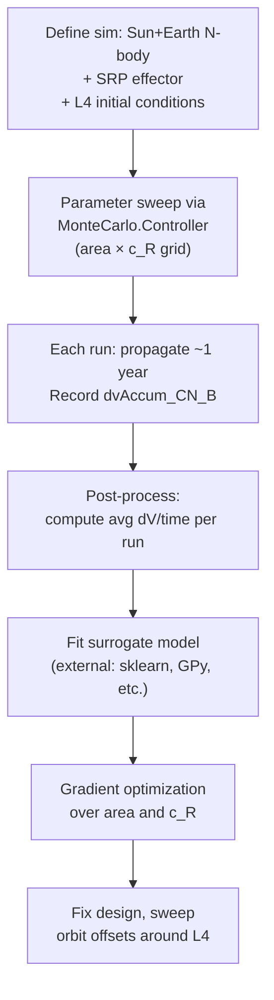

# Question
I am trying optimize the design of a cubesat that would be deploied on sun earth L4 orbit, in order to put the orbital mechanics into design consideration, we would like to make use of this package to produce a responce surface or surrogate model that connects our design factors, so that later on we can conduct gradient optimization. The major design factor that would influence the orbit is the solar panel area and the relative reflectivity of the cubesat, which would affect the solar radiation pressure force. We would like to simulate the orbital behavior to find out the averged delta v required over time to know what engine we need to handle the orbit correction required (we know L4 is stationary that if not external perturbation, we do not have to consider orbit correction). With this, we would get a response curve relating the solar panel area and reflectivity (material related) to the time averaged delta v required at a given orbit. After using the response curve/surrogate model to optimize our cubesat design, we would fix that design and adjust the orbit design to see if we can find a more suitable orbit around L4. Please let me know how I can make use of this library.

# Answer

Basilisk has all the building blocks you need for this workflow. Here's how to assemble them:

---

## Relevant Modules

### 1. Sun-Earth L4 Orbit (N-body dynamics)

The `scenarioLagrangePointOrbit` example (referenced in the release notes and tested in `src/tests/test_scenarioLagrangePointOrbit.py`) covers all five Sun-Earth Lagrange points including L4 and L5. [1](#0-0) 

For a heliocentric simulation, set the Sun as the central body and add Earth as a perturbing body using `gravBodyFactory` with SPICE ephemeris:

```python
from Basilisk.utilities.simIncludeGravBody import gravBodyFactory
gravFactory = gravBodyFactory()
sun = gravFactory.createSun()
sun.isCentralBody = True          # Sun-centered dynamics
earth = gravFactory.createEarth() # Earth as perturber
gravFactory.createSpiceInterface(path, time='2025 JAN 01 00:00:00.0 (UTC)')
scObject.gravField.gravBodies = spacecraft.GravBodyVector(list(gravFactory.gravBodies.values()))
``` [2](#0-1) 

Set the initial position/velocity at the L4 point (60° ahead of Earth in its orbit, at 1 AU from the Sun).

---

### 2. Solar Radiation Pressure — Your Two Design Variables

**Option A: Cannonball model** (simpler, good for response surface)

The `radiationPressure` module exposes exactly your two design variables:
- `srp.area` — cross-sectional area in m² (maps to solar panel area)
- `srp.coefficientReflection` — reflectivity coefficient `c_R` (maps to surface material)

```python
from Basilisk.simulation import radiationPressure
srp = radiationPressure.RadiationPressure()
srp.area = 0.06          # m^2 — your design variable
srp.coefficientReflection = 1.3  # your design variable
srp.sunEphmInMsg.subscribeTo(gravFactory.spiceObject.planetStateOutMsgs[0])
scObject.addDynamicEffector(srp)
``` [3](#0-2) [4](#0-3) 

The force scales as `F ∝ c_R × A / r_sun²`, so both variables enter linearly in the cannonball model.

**Option B: Faceted model** (higher fidelity, per-face specular/diffuse coefficients)

`facetSRPDynamicEffector` lets you define each face of the CubeSat with its own area, normal, and optical coefficients (`facetSpecularCoeff`, `facetDiffuseCoeff`). This is more realistic for a CubeSat with solar panels at varying angles. [5](#0-4) 

---

### 3. Measuring Delta-V Required

The `spacecraft` module automatically tracks accumulated non-gravitational delta-V in `dvAccum_CN_B`. This is the velocity change accumulated from all non-gravitational forces (i.e., SRP in your case) — which is exactly the delta-V budget needed for station-keeping corrections. [6](#0-5) 

Log it via the spacecraft state output message:
```python
scStateRec = scObject.scStateOutMsg.recorder()
sim.AddModelToTask(simTaskName, scStateRec)
# After simulation:
dv_accumulated = scStateRec.dvAccum_CN_B  # shape (N, 3)
dv_magnitude = np.linalg.norm(dv_accumulated, axis=1)
avg_dv_rate = dv_magnitude[-1] / total_sim_time  # m/s per second
```

This gives you the time-averaged delta-V rate directly without needing a closed-loop controller.

---

### 4. Building the Response Surface — Parameter Sweep

Use the `MonteCarlo.Controller` for systematic parameter sweeps. Despite the name, it supports deterministic grid sweeps too — just use `UniformDispersion` with fixed bounds or write a custom dispersion class that steps through a grid. [7](#0-6) [8](#0-7) 

The pattern is:
```python
from Basilisk.utilities.MonteCarlo.Controller import Controller, RetentionPolicy
from Basilisk.utilities.MonteCarlo.Dispersions import UniformDispersion

mc = Controller()
mc.setSimulationFunction(myCreationFunction)   # returns a configured sim
mc.setExecutionFunction(myExecutionFunction)   # calls sim.InitializeSimulation() + ExecuteSimulation()
mc.setExecutionCount(N_RUNS)
mc.setThreadCount(N_CORES)  # parallel execution

# Sweep solar panel area
mc.addDispersion(UniformDispersion(
    'TaskList[0].TaskModels[SRP_INDEX].area',
    bounds=[0.01, 0.10]  # m^2 range
))
# Sweep reflectivity
mc.addDispersion(UniformDispersion(
    'TaskList[0].TaskModels[SRP_INDEX].coefficientReflection',
    bounds=[1.0, 2.0]
))

# Retain the accumulated DV
policy = RetentionPolicy()
policy.addMessageLog('scStateMsg', ['dvAccum_CN_B'])
mc.addRetentionPolicy(policy)

mc.executeSimulations()
``` [9](#0-8) 

After the runs, retrieve results with `mc.getRetainedData(i)` and `mc.getParameters(i)` to pair each run's `(area, c_R)` inputs with the resulting `dvAccum` output. Feed this into your surrogate model (e.g., Gaussian process, polynomial response surface) using any Python ML library.

---

## Suggested Workflow



---

## Key Caveats

1. **L4 stability**: Sun-Earth L4 is only weakly stable. The SRP perturbation will cause slow drift. Your simulation duration needs to be long enough (months to years) to accumulate meaningful delta-V signal.

2. **No built-in station-keeping controller for L4**: Basilisk does not include an L4 station-keeping FSW module. The `dvAccum_CN_B` approach above measures the SRP-induced drift directly, which is the correct proxy for required correction delta-V.

3. **Attitude assumption**: The cannonball SRP model assumes a fixed effective area regardless of attitude. If your CubeSat attitude varies (e.g., sun-pointing solar panels), use `facetSRPDynamicEffector` with articulated facets. [10](#0-9) 

4. **Response surface vs. MC**: The `MonteCarlo.Controller` uses random dispersions by default. For a structured design-of-experiments grid, you can either write a custom `Dispersion` subclass that steps through a Latin hypercube or full-factorial grid, or simply run the simulation in a plain Python loop and collect results manually — Basilisk simulations are just Python objects.

### Citations

**File:** src/tests/test_scenarioLagrangePointOrbit.py (L52-58)
```python
@pytest.mark.parametrize("lagrangePoint, nOrbits, timestep, showPlots", [
    (1, 1, 300, False),
    (2, 1, 300, False),
    (3, 1, 300, False),
    (4, 1, 300, False),
    (5, 1, 300, False)
])
```

**File:** src/utilities/simIncludeGravBody.py (L265-276)
```python
    def createSun(self):
        return self.createBody("sun")

    def createMercury(self):
        return self.createBody("mercury")

    def createVenus(self):
        return self.createBody("venus")

    def createEarth(self):
        return self.createBody("earth")

```

**File:** src/simulation/dynamics/RadiationPressure/_Documentation/secUserGuide.tex (L17-24)
```tex
		\textbf{Variable}   		& \textbf{LaTeX Equivalent} 	                  &		\textbf{Variable Type}   & \textbf{Notes} \\ \hline
		area 						  	  & $A_{\odot}$							  & double 								& [m2] Default setting: 0.0f. Required input for cannonball method to get any real output. This is the area to use when approximating the surface area of the spacecraft.\\ \hline
		coefficientReflection 	  & $c_{R}$ 								& double 								& Default setting: 1.2. This is a factor applied to the radiation pressure based on spacecraft surface properties.\\ \hline
		sunEclipseMsgData		& N/A										& string									& No default. If creating a "fake" eclipse message, set to radiation\_pressure.EclipseSimMsg() \\ \hline
		sunEclipseMsgData.shadowFactor & $F_{\mathrm{s}}$& double								& Default setting: 1.0. i.e. there is no shadow by default. \\ \hline
	\end{tabular}
	\label{tabular:vars}
\end{table}
```

**File:** src/simulation/dynamics/RadiationPressure/radiationPressure.cpp (L161-171)
```cpp
void RadiationPressure::computeCannonballModel(Eigen::Vector3d s_N)
{
    /* Magnitude of sun vector in the body frame */
    double sunDist = s_N.norm();
    /* Computing the force vector [N]*/
    double scaleFactor = (-this->coefficientReflection * this->area * SOLAR_FLUX_EARTH * pow(AU*1000.,2)) / (SPEED_LIGHT * pow(sunDist, 3));
    if (stateRead)
        this->forceExternal_N = scaleFactor*(s_N);
    else
        this->forceExternal_N.setZero();
}
```

**File:** src/simulation/dynamics/facetSRPDynamicEffector/facetSRPDynamicEffector.h (L36-44)
```text
typedef struct {
    std::vector<double> facetAreaList;                                //!< [m^2] Vector of facet areas
    std::vector<Eigen::Matrix3d> facetDcm_F0BList;                    //!< Vector of facet frame F initial attitude DCMs relative to the B frame
    std::vector<Eigen::Vector3d> facetNHat_FList;                     //!< Vector of facet normals expressed in facet F frame components
    std::vector<Eigen::Vector3d> facetRotHat_FList;                   //!< [m] Vector of facet rotation axes expressed in facet F frame components
    std::vector<Eigen::Vector3d> facetR_CopB_BList;                   //!< [m] Vector of facet COP locations wrt point B expressed in B frame components
    std::vector<double> facetDiffuseCoeffList;                        //!< Vector of facet diffuse reflection optical coefficients
    std::vector<double> facetSpecularCoeffList;                       //!< Vector of facet spectral reflection optical coefficients
}FacetedSRPSpacecraftGeometryData;
```

**File:** src/simulation/dynamics/spacecraftSystem/spacecraftSystem.cpp (L980-1004)
```cpp
void SpacecraftSystem::calculateDeltaVandAcceleration(SpacecraftUnit &spacecraft, double localTimeStep)
{
    // - Find v_CN_N after the integration for accumulated DV
    Eigen::Vector3d newV_BN_N = spacecraft.hubV_N->getState(); // - V_BN_N after integration
    Eigen::Vector3d newV_CN_N;  // - V_CN_N after integration
    Eigen::MRPd newSigma_BN;    // - Sigma_BN after integration
    // - Get center of mass, v_BN_N and dcm_NB
    Eigen::Vector3d sigmaBNLoc;
    sigmaBNLoc = (Eigen::Vector3d) spacecraft.hubSigma->getState();
    newSigma_BN = sigmaBNLoc;
    Eigen::Matrix3d newDcm_NB = newSigma_BN.toRotationMatrix();  // - dcm_NB after integration
    newV_CN_N = newV_BN_N + newDcm_NB*(*spacecraft.cDot_B);

    // - Find accumulated DV of the center of mass in the body frame
    spacecraft.dvAccum_CN_B += newDcm_NB.transpose()*(newV_CN_N -
                                                    spacecraft.BcGravVelocity->getState());

    // - Find the accumulated DV of the body frame in the body frame
    spacecraft.dvAccum_BN_B += newDcm_NB.transpose()*(newV_BN_N -
                                                    spacecraft.hubGravVelocity->getState());

    // - non-conservative acceleration of the body frame in the body frame
    spacecraft.nonConservativeAccelpntB_B = (newDcm_NB.transpose()*(newV_BN_N -
                                                                   spacecraft.hubGravVelocity->getState()))/localTimeStep;

```

**File:** src/utilities/MonteCarlo/Controller.py (L49-75)
```python
class Controller:
    """
    The MonteCarloController class is used to run a monte carlo simulation.
    It is used to execute multiple runs of a simulation with varying initial parameters. Data from each run is retained
    in order to analyze differences in the simulation runs and the parameters used.
    """

    def __init__(self):
        self.executionCount = 0
        self.ICrunFlag = False
        self.icDirectory = ""
        self.archiveDir = None
        self.varCast = None
        self.numProcess = mp.cpu_count()

        self.simParams = SimulationParameters(
            creationFunction=None,
            executionFunction=None,
            configureFunction=None,
            retentionPolicies=[],
            shouldArchiveParameters=False,
            shouldDisperseSeeds=False,
            dispersions=[],
            filename="",
            icfilename=""
        )

```

**File:** src/utilities/MonteCarlo/Dispersions.py (L64-76)
```python
class UniformDispersion(SingleVariableDispersion):
    def __init__(self, varName, bounds=None):
        SingleVariableDispersion.__init__(self, varName, bounds)
        if self.bounds is None:
            self.bounds = ([-1.0, 1.0])  # defines a hard floor/ceiling

    def generate(self, sim):
        dispValue = random.uniform(self.bounds[0], self.bounds[1])

        mid = (self.bounds[1] + self.bounds[0])/2.
        scale = self.bounds[1] - mid
        self.magnitude.append(str(round((dispValue - mid)/scale*100,2)) + " %")
        return dispValue
```

**File:** src/utilities/MonteCarlo/_UnitTests/test_scenarioBasicOrbitMC.py (L134-174)
```python
def test_MonteCarloSimulation(show_plots):
    # Test a montecarlo simulation
    dirName = os.path.abspath(os.path.dirname(__file__)) + "/tmp_montecarlo_test"
    monteCarlo = Controller()
    monteCarlo.setShouldDisperseSeeds(True)
    monteCarlo.setExecutionFunction(myExecutionFunction)
    monteCarlo.setSimulationFunction(myCreationFunction)
    monteCarlo.setExecutionCount(NUMBER_OF_RUNS)
    monteCarlo.setThreadCount(PROCESSES)
    monteCarlo.setVerbose(True)
    monteCarlo.setArchiveDir(dirName)

    # Add some dispersions
    disp1Name = 'TaskList[0].TaskModels[0].hub.sigma_BNInit'
    disp2Name = 'TaskList[0].TaskModels[0].hub.omega_BN_BInit'
    disp3Name = 'TaskList[0].TaskModels[0].hub.mHub'
    disp4Name = 'TaskList[0].TaskModels[0].hub.r_BcB_B'
    disp5Name = 'TaskList[0].TaskModels[0].hub.r_CN_NInit'
    disp6Name = 'TaskList[0].TaskModels[0].hub.v_CN_NInit'
    dispDict = {}
    dispDict["mu"] = 0.3986004415E+15
    dispDict["a"] = ["normal", 42000 * 1E3, 2000 * 1E3]
    dispDict["e"] = ["uniform", 0, 0.5]
    dispDict["i"] = ["uniform", -80, 80]
    dispDict["Omega"] = None
    dispDict["omega"] = ["uniform", 80, 90]
    dispDict["f"] = ["uniform", 0, 359]
    monteCarlo.addDispersion(OrbitalElementDispersion(disp5Name, disp6Name, dispDict))
    monteCarlo.addDispersion(UniformEulerAngleMRPDispersion(disp1Name))
    monteCarlo.addDispersion(NormalVectorCartDispersion(disp2Name, 0.0, 0.75 / 3.0 * np.pi / 180))
    monteCarlo.addDispersion(UniformDispersion(disp3Name, ([1300.0 - 812.3, 1500.0 - 812.3])))
    monteCarlo.addDispersion(
        NormalVectorCartDispersion(disp4Name, [0.0, 0.0, 1.0], [0.05 / 3.0, 0.05 / 3.0, 0.1 / 3.0]))

    # Add retention policy
    retentionPolicy = RetentionPolicy()
    retentionPolicy.addMessageLog(retainedMessageName, [var1, var2])
    retentionPolicy.setDataCallback(myDataCallback)
    monteCarlo.addRetentionPolicy(retentionPolicy)

    failures = monteCarlo.executeSimulations()
```

**File:** src/simulation/dynamics/facetSRPDynamicEffector/facetSRPDynamicEffector.rst (L1-10)
```text
Executive Summary
-----------------
This dynamic effector module uses a faceted spacecraft model to calculate the force and torque acting on a spacecraft
due to solar radiation pressure (SRP). The force and torque are calculated about the spacecraft body frame origin
point :math:`B`. The module can be configured for either a static spacecraft or a spacecraft with any number of
articulating facets. For example, a spacecraft with two articulating solar arrays can be configured using 4
articulating facets. The unit test for this module shows how to set up this particular configuration.

.. warning::
    The module variables ``numFacets`` and ``numArticulatedFacets`` will be moved to private module variables
```
