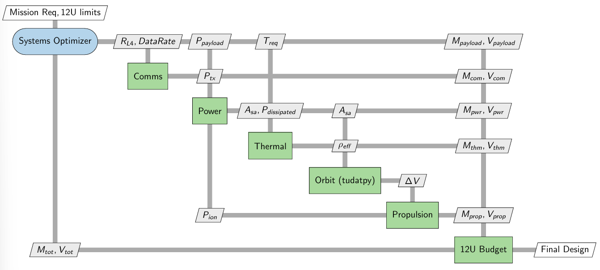

# ME4890 Final Project Proposal: Project Sol-Sentinel
**Mission:** 12U Space Weather Forecasting CubeSat at Sun-Earth L4  
**Team Size:** 4 Members  
**Form Factor:** 12U CubeSat  

## 1. Mission Overview
The objective of this mission is to design a standalone 12U CubeSat positioned at the Sun-Earth Lagrange 4 (L4) point to serve as an early-warning space weather observatory. By trailing the Sun-Earth line by 60 degrees, the CubeSat will detect Coronal Mass Ejections (CMEs) and solar wind variations days before they impact Earth.

The primary research objective is now formulated as a two-stage optimization problem. First, given a candidate Sun-Earth L4 orbit selected from prior literature, we will optimize the spacecraft design to minimize total mass and occupied volume while satisfying communications, power, thermal, and station-keeping requirements. Second, after fixing the optimized spacecraft design, we will tune the orbit parameters around L4 to determine whether a better operational orbit exists for that final vehicle.

**Scope Limitation:** To focus deeply on operational orbital dynamics and system design within the 12U constraint, this project assumes the CubeSat has already been successfully injected into the L4 region. The design of the interplanetary transit phase is excluded from this scope.

## 2. Technical Challenges & Feasibility (Marking Criterion #3)
While L4 is dynamically stable (unlike L1/L2), the mission presents several highly coupled engineering challenges:
1.  **Reference Orbit Selection:** There is no single canonical operational orbit around Sun-Earth L4 for a 12U spacecraft. We must begin with a literature-based candidate orbit, then later verify whether nearby orbit parameters reduce station-keeping cost.
2.  **Orbital Perturbations:** Because a 12U CubeSat has a low mass-to-area ratio, Solar Radiation Pressure (SRP) acts as a solar sail, pushing the satellite away from its intended L4 operating region.
3.  **Deep-Space Communications:** Transmitting early-warning data across roughly 1 Astronomical Unit (1 AU) requires a deployable high-gain antenna and high RF power.
4.  **Thermal Management:** At L4, the spacecraft experiences zero eclipses (constant 100% solar flux). Rejecting the heat from the Sun, the payload, and the high-power transmitter is a critical design driver.

## 3. Iterative Design Methodology (Marking Criterion #4)
Our team will utilize a Concurrent Engineering approach with a Basilisk-based surrogate modeling workflow to solve the heavily coupled design constraints.

### Stage 1: Orbit-Informed Spacecraft Design Optimization
*   Select a candidate Sun-Earth L4 orbit from prior research studies as the reference orbit.
*   Use Basilisk to propagate the spacecraft dynamics in the Sun-Earth environment with Solar Radiation Pressure (SRP) enabled.
*   Sweep the main orbit-sensitive design variables, namely solar panel area and effective reflectivity coefficient, and record the time-averaged station-keeping requirement.
*   Construct a response surface / surrogate model that maps $(A_{sa}, c_R)$ to average required $\Delta V_{avg}$ on the reference orbit.
*   Use that surrogate inside the system budgets to minimize spacecraft mass and occupied volume while maintaining feasible propulsion, power, communications, and thermal performance.

### Stage 2: Orbit Tuning with Fixed Design
*   Freeze the optimized spacecraft configuration from Stage 1.
*   Vary candidate orbit parameters around the L4 region and re-run the Basilisk analysis.
*   Compare station-keeping cost and subsystem impacts across candidate orbits to identify a better operational orbit for the finalized spacecraft.

The primary trade loop therefore becomes the **Orbit-SRP-Propulsion-Power-Mass/Volume Trade-off**:
*   Larger solar arrays provide more electrical power.
*   Larger exposed area and higher reflectivity increase SRP.
*   Increased SRP raises the average station-keeping $\Delta V_{avg}$ demand.
*   Higher $\Delta V_{avg}$ demand requires a larger propulsion system and more propellant.
*   More propulsion hardware and propellant increase both mass and occupied volume, which can violate the 12U constraint.
*   **Goal:** Converge on the minimum-mass, minimum-volume spacecraft that closes all subsystem budgets on a literature-based reference orbit, then test whether a nearby orbit performs even better.

## 4. Team Structure & Work Division

### Sub-Team 1: Orbital Dynamics & Propulsion (The Platform Team)
**Focus:** Simulating the L4 environment and designing the station-keeping system.

*   **Member A: Dynamicist & Lead Programmer**
    *   Review literature to identify a representative Sun-Earth L4 orbit to use as the baseline design case.
    *   Develop a Basilisk simulation of the Sun-Earth environment using the existing Lagrange-point scenario structure, SPICE ephemerides, and Solar Radiation Pressure (SRP) modeling.
    *   Run parameter sweeps over solar panel area and reflectivity to quantify orbital drift and accumulated non-gravitational $\Delta V_{avg}$.
    *   Generate the response surface / surrogate model that links spacecraft geometry and surface properties to average station-keeping demand.
    *   *Deliverable:* Basilisk simulation code, response-surface plots, and orbital drift results over the mission lifespan.

*   **Member B: Propulsion Engineer**
    *   Utilize the average $\Delta V$ results from Member A to calculate the propulsion requirement over the mission lifetime.
    *   Select an appropriate miniaturized Electric/Ion propulsion system (e.g., electrospray or miniature Hall-effect thruster).
    *   Calculate the required propellant mass and the physical volume ("U" space) of the thruster/tank system.
    *   Support the second-stage orbit sweep by comparing how candidate L4 orbits change station-keeping burden for the fixed spacecraft design.
    *   *Deliverable:* Propulsion system specifications, power requirements, and orbit-to-propulsion trade data for the system budget.

### Sub-Team 2: Systems & Payload (The Operations Team)
**Focus:** Selecting weather forecasting equipment, power, thermal, and maintaining the 12U budget.

*   **Member C: Payload & Communications Engineer**
    *   Select COTS (Commercial Off-The-Shelf) miniaturized space weather instruments (e.g., Solar Magnetometer, EUV Imager) and determine their data output and physical volume.
    *   Design the deep-space Communications Link Budget to transmit data across the worst-case Earth range associated with the selected reference orbit.
    *   Select a deployable X-Band antenna and calculate the required transmitter power.
    *   Assess whether the second-stage orbit tuning changes the communications margin enough to affect the final design choice.
    *   *Deliverable:* Payload layout, link budget, and peak power consumption profile.

*   **Member D: Power, Thermal, and Systems Integrator**
    *   **Power:** Size the solar arrays to handle the constant load of the transmitter and ion thruster, while recognizing that solar array area is also a driver of SRP. (No eclipse battery sizing is required; small batteries will be used only for power conditioning).
    *   **Thermal:** Calculate the heat load (100% solar flux + internal electronics) and size thermal radiators to prevent the CubeSat from overheating.
    *   **Integration:** Maintain the Master Equipment List (MEL). Combine the subsystem outputs with the Basilisk-derived surrogate model to track total mass and physical volume and drive the design toward a minimum-mass, minimum-volume solution within 12U.
    *   *Deliverable:* Final System Mass/Volume/Power Budgets, optimization iteration tracking, and the final integrated design choice.

## 5. Software & Tools
*   **Python + Basilisk:** For Sun-Earth L4 orbital propagation, Solar Radiation Pressure modeling, parameter sweeps, and extraction of average station-keeping $\Delta V$. The Basilisk-based workflow is documented in the [bsk.md](bsk.md) manual.
*   **Python Scientific Stack:** NumPy / SciPy for post-processing and surrogate fitting, with optional use of scikit-learn or similar tools to construct the response surface used in optimization.
*   **MATLAB / Excel:** For Link Budget and Power/Mass Budget tracking.
*   **CAD (Optional):** SolidWorks/Fusion360 to visually demonstrate that the selected components fit within a standard 12U dispenser volume.

## 6. Expected Results & Report Structure (Marking Criteria #1, #2, #5)
1.  **Abstract & Introduction:** Justifying the L4 space weather mission.
2.  **Mission Architecture:** Demonstrating the two-stage optimization process: spacecraft design optimization on a reference orbit, followed by orbit tuning with the fixed final design.
3.  **Results & Analysis (Basilisk):** Graphical evidence of L4 orbital drift and a response surface relating solar panel area and reflectivity to average required $\Delta V$.
4.  **Subsystem Design:** Evidence of COTS component selection and the optimized minimum-mass / minimum-volume spacecraft configuration.
5.  **Orbit Trade Study:** Comparison of candidate L4 orbit parameters using the finalized spacecraft design.
6.  **Conclusion:** Final completed 12U design budgets, the selected orbit/design pair, and evidence of feasibility.
7.  **Appendix:** Full Python/Basilisk code used for simulations and surrogate generation.

---

# Project Sol-Sentinel: Systems Architecture & XDSM Formulation

## Overview
This document details the Extended Design Structure Matrix (XDSM) formulated for **Project Sol-Sentinel**, a 12U CubeSat designed for space weather forecasting at the Sun-Earth L4 Lagrange point.

Because deep-space CubeSat design features highly coupled physical constraints, a linear design approach is insufficient. We utilize a **Concurrent Engineering** and Multidisciplinary Design Optimization (MDO) framework in which Basilisk provides the orbit-response data used by the system optimizer. The XDSM visualizes the data flow between sub-teams, highlighting the feedback loops required to minimize spacecraft mass and volume within a strict 12U / 24kg limit while preserving feasible orbital performance.

---

## 1. XDSM Formulation & Data Flow

The XDSM is divided into three distinct flow categories: the Global Inputs, the Forward Design Cascade, and the Iterative Feedback Loops.

### A. Global Inputs (Mission Requirements)
The **Systems Optimizer** acts as the mission architect. It defines the payload (scientific instruments), the reference orbit selected from literature, and the mission environment, passing static constraints to the subsystems:
*   **To Orbit:** Passes the baseline L4 orbit parameters, propagation horizon, and allowable operating deadband.
*   **To Comms:** Passes $R_{L4}$ (worst-case distance to Earth on the reference orbit) and telemetry $DataRate$.
*   **To Power:** Passes $P_{payload}$ (Constant electrical draw of the instruments).
*   **To Thermal:** Passes $T_{req}$ (Operational temperature limits for the payload).
*   **To Budget:** Deducts $M_{payload}$ and $V_{payload}$ directly from the 12U constraints.

### B. The Forward Design Cascade
Subsystems size their hardware sequentially based on the inputs received:
1.  **Comms $\rightarrow$ Power:** The Comms team uses the Friis Transmission Equation to calculate the required transmitter power ($P_{tx}$) to push a signal across the reference L4 geometry, passing this load to the Power team.
2.  **Power $\rightarrow$ Thermal & Orbit:** The Power team sizes the Solar Array Area ($A_{sa}$) to satisfy $P_{tx} + P_{payload} + P_{ion}$. $A_{sa}$ is passed to Thermal (for heat load) and Orbit (as an SRP-sensitive exposed area).
3.  **Thermal $\rightarrow$ Orbit:** The Thermal team calculates the area-weighted effective reflectivity ($\rho_{eff}$) using the surface area of the solar panels and the chassis coating. This determines how strongly photon momentum is transferred to the spacecraft.
4.  **Orbit $\rightarrow$ Propulsion & Optimizer:** Using Basilisk, the Orbit team simulates the Solar Radiation Pressure (SRP) acting on $A_{sa}$ and $\rho_{eff}$ for the reference orbit. It converts the resulting drift into average station-keeping $\Delta V$, then fits a response surface so the Systems Optimizer can evaluate design candidates quickly.
5.  **Propulsion $\rightarrow$ Budget:** The Propulsion team uses the average $\Delta V$ requirement to size the thruster and propellant system, then passes propulsion mass ($M_{prop}$), volume ($V_{prop}$), and power ($P_{ion}$) into the integrated budget.
6.  **Subsystems $\rightarrow$ Budget:** All disciplines pass their respective mass ($M$) and volume ($V$) parameters to the 12U Budget manager.

### C. The Iterative Feedback Loops
The design is driven by two critical feedback loops that force numerical iteration:
1.  **The Design Physics Loop ($P_{ion}$):** The Propulsion system selects an Ion Engine to provide the necessary $\Delta V$. This engine requires electrical power ($P_{ion}$), which is passed *backward* to the Power system. This forces $A_{sa}$ to increase, which increases SRP, which increases average $\Delta V$, which increases $P_{ion}$. The surrogate model makes this loop fast enough to iterate until the design reaches a stable minimum-mass / minimum-volume baseline.
2.  **The Orbit Tuning Loop:** Once the spacecraft design is fixed, the Orbit node varies candidate L4 orbit parameters and re-evaluates average station-keeping demand in Basilisk. If a nearby orbit reduces propulsion burden or relaxes subsystem constraints, that orbit becomes the updated mission baseline.

---

## 2. Assumptions and Limitations

To ensure computational efficiency and scope the project appropriately for the ME4890 constraints, the following assumptions and limitations were implemented in this XDSM formulation:

### Assumption 1: Fixed Reference Orbit During Primary Design Optimization
The first optimization stage assumes a single candidate Sun-Earth L4 orbit selected from published research as the baseline orbit. Orbit parameters are held fixed while the spacecraft design is optimized.
*   *Justification:* This separates the design problem from the orbit-search problem, allowing the team to first construct a stable surrogate model for spacecraft sizing. Orbit tuning is then performed as a dedicated second-stage trade study using the finalized vehicle.

### Assumption 2: Orbit Insertion is Excluded
The design framework assumes the CubeSat has already been delivered to the L4 vicinity by a rideshare mothership (e.g., an ESPA ring on an interplanetary mission). 
*   *Justification:* Calculating the trans-lunar or interplanetary injection trajectory requires hundreds of meters-per-second of $\Delta V$, which would dominate the entire design and mask the nuanced operational physics of L4 station-keeping.

### Assumption 3: Absence of Eclipses
Because the spacecraft operates at the Sun-Earth L4 point, it is never shadowed by the Earth or the Moon. 
*   *Justification:* Standard LEO battery sizing equations (which rely on orbital period eclipse fractions) are not used. Battery sizing is assumed to be minimal and dictated strictly by power-conditioning requirements (e.g., managing short-term current spikes from the Ion Engine or X-band transmitter).

### Limitation 1: Simplified SRP Geometry for Surrogate Generation
The first-pass surrogate model treats SRP using an effective exposed area and reflectivity parameterization. This may be implemented with Basilisk's cannonball SRP representation before a more detailed faceted check is performed.
*   *Justification:* A low-order SRP model keeps the design sweep computationally tractable while still capturing the dominant coupling between solar array area, reflectivity, and station-keeping burden.

### Limitation 2: Average $\Delta V$ as a Station-Keeping Proxy
The Basilisk workflow uses accumulated non-gravitational $\Delta V$ to estimate the average station-keeping burden caused by SRP rather than simulating a closed-loop L4 control law.
*   *Justification:* This is sufficient for ranking spacecraft designs and orbit candidates during optimization, even though final guidance and control design would require a higher-fidelity station-keeping simulation.

### Limitation 3: Simplified Thermal Node Analysis
The thermal environment assumes a simplified, isothermal, area-weighted approach to calculate $\rho_{eff}$ and steady-state temperature ($T_{eq}$). We do not employ a full 3D Finite Element Nodal model. Consequently, transient thermal shadowing from deployable antennas or solar arrays is not captured.