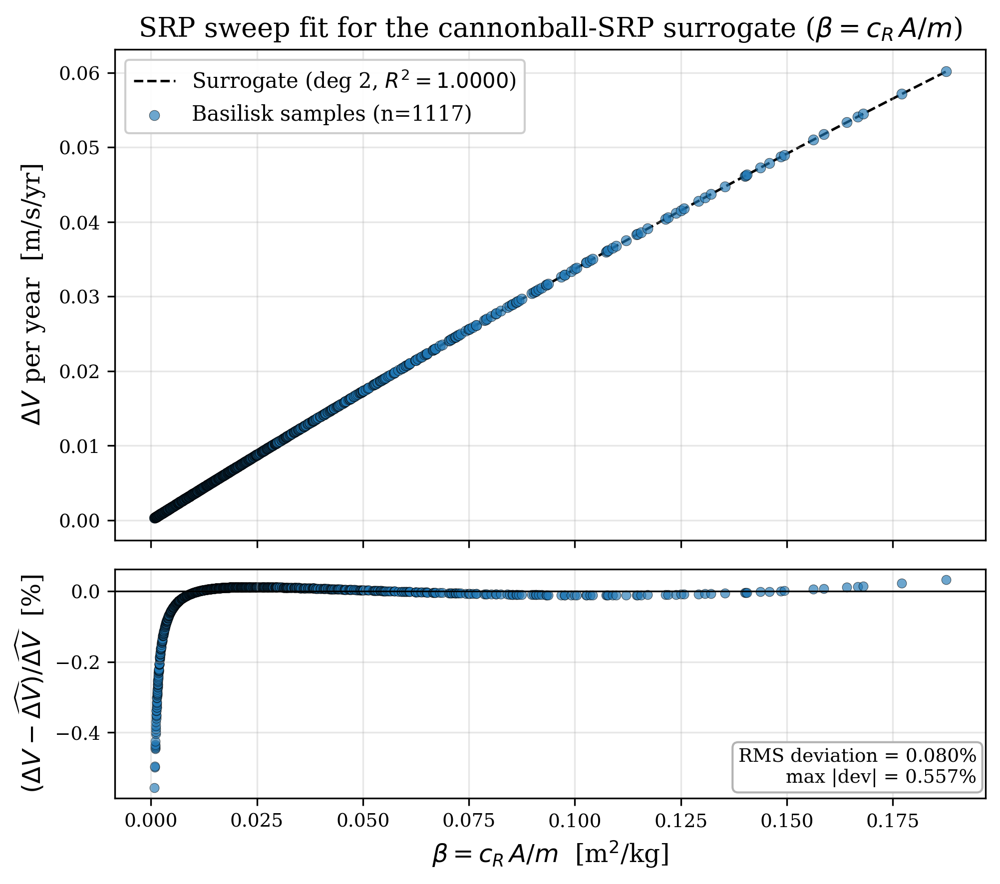
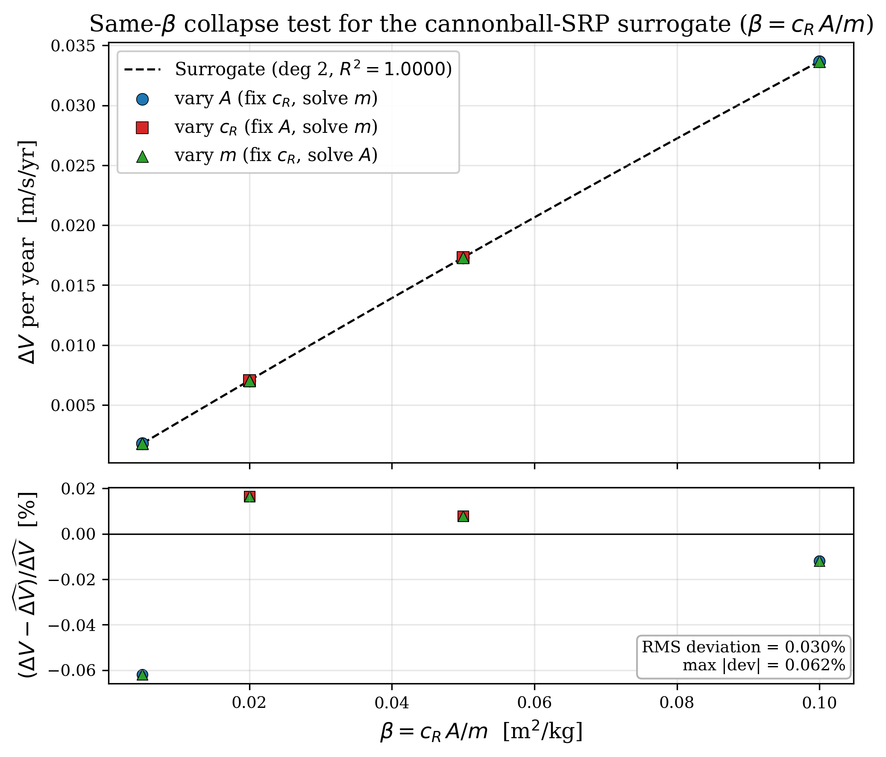

# Solar Radiation Pressure Response Curve and Surrogate Validation

## 1. Introduction

This note summarizes the Solar Radiation Pressure (SRP) response-curve experiment carried out for the low-inclination Sun-Earth L4 reference orbit. The purpose of the experiment is to quantify how the SRP-induced station-keeping burden varies with spacecraft optical and geometric properties, and to replace a large set of repeated high-fidelity propagations with a compact analytic surrogate that can later be used inside the system-level design loop. The present document explains the modelling assumptions, the definition of the ballistic coefficient, the simulation methodology used to obtain the data, the curve-fitting procedure, and the interpretation of the two resulting figures.

## 2. SRP Model and Assumptions

The present study uses the cannonball SRP model available in Basilisk. In this representation the spacecraft is treated as an equivalent illuminated body with effective projected area $A$, bulk reflectivity coefficient $c_R$, and total spacecraft mass $m$. In the coupled optimization framework, the upstream thermal module is more naturally expressed in terms of an effective surface reflectivity $\rho_s \in [0,1]$, and the cannonball coefficient is formed as $c_R = 1 + \rho_s$, so that $c_R \in [1,2]$ remains consistent with the standard absorber-to-mirror interpretation used by Basilisk. The SRP acceleration is therefore written as

$$
\mathbf{a}_{\mathrm{SRP}} = -\frac{q_\odot}{c}\,\frac{c_R A}{m}\,\hat{\mathbf{s}} ,
\tag{1}
$$

where $q_\odot$ is the solar flux at the spacecraft at distance of 1 AU, $c$ is the speed of light, and $\hat{\mathbf{s}}$ is the Sun-line unit vector. Equation (1) is the standard preliminary-design form of SRP modelling: it preserves the dominant translational scaling with reflectivity, illuminated area, and inverse mass, while avoiding the geometric and attitude detail required by a faceted model.

Several assumptions are implicit in this formulation and should be kept in mind when interpreting the results. First, the reference orbit is fixed to the low-inclination L4 case rather than being re-optimized simultaneously with the spacecraft design variables. This choice is deliberate: the purpose of the SRP sweep is to break the orbit-design/spacecraft-design coupling and isolate how spacecraft properties alone map into SRP-driven drift burden, so that a compact surrogate can be built for use in the later system-level optimization loop. The low-inclination branch was selected instead of the larger-amplitude recommended-inclination orbit because the recommended orbit would require additional $\Delta V$, whereas the selected orbit still enables observation of both the solar north and south poles, albeit with a smaller vertical excursion. The fitted response curve is therefore valid only for this low-inclination orbital configuration and not yet for the recommended-inclination or any retuned trajectory. Second, the spacecraft is reduced to a cannonball equivalent, meaning that panel orientation, facet normals, self-shadowing, and surface-to-surface optical differences are not explicitly modelled. This simplification is also intentional: the final CubeSat configuration has not yet been frozen, so a higher-fidelity faceted optical model would introduce geometric detail that is not yet credibly defined. At the present stage, the cannonball model is used to obtain a defensible first estimate of the SRP-related $\Delta V$ burden at low computational cost. Third, the response variable is not the result of a closed-loop station-keeping controller; instead, the experiment uses accumulated non-gravitational drift as a proxy for the control effort that would eventually be required to hold the mission orbit. Fourth, the propagation horizon is fixed to three years, so the resulting annualized $\Delta V$ values are self-consistent only for that duration. This last point matters because the SRP acceleration direction rotates in inertial space over the heliocentric motion, which means the annualized drift metric is duration-dependent rather than perfectly linear in time.

## 3. Ballistic Coefficient and Its Relation to $\Delta V$

The natural collapse variable for the cannonball SRP model is the ballistic coefficient

$$
\beta = \frac{c_R A}{m} .
\tag{2}
$$

If the design loop is parameterized by the thermal-module output $\rho_s$, then Equation (2) may equivalently be written as $\beta = (1 + \rho_s)A/m$.

Substituting Equation (2) into Equation (1) gives

$$
\mathbf{a}_{\mathrm{SRP}} = -\frac{q_\odot}{c}\,\beta\,\hat{\mathbf{s}} .
\tag{3}
$$

Equation (3) shows that, within the cannonball approximation, all dependence on spacecraft properties enters through the single scalar $\beta$. A larger illuminated area or reflectivity increases $\beta$, whereas a larger mass reduces it. As a result, designs with different triples $(A, c_R, m)$ but the same $\beta$ should experience the same SRP acceleration magnitude and, to first order, the same long-term drift burden.

Basilisk's spacecraft state output also provides an accumulated non-gravitational velocity-change quantity, which may be interpreted as the time-integrated effect of all non-conservative accelerations acting on the vehicle over the propagation. In general,

$$
\Delta \mathbf{V}_{\mathrm{ng}}(T) = \int_0^T \mathbf{a}_{\mathrm{ng}}(t)\,dt .
	\tag{4}
$$

In the present simulations, SRP is the only non-gravitational effector enabled, so the accumulated non-gravitational velocity-change reduces to the SRP contribution alone:

$$
\Delta \mathbf{V}_{\mathrm{SRP}}(T) = \Delta \mathbf{V}_{\mathrm{ng}}(T) = \int_0^T \mathbf{a}_{\mathrm{SRP}}(t)\,dt .
	\tag{5}
$$

Substituting Equation (3) into Equation (5) gives

$$
\Delta \mathbf{V}_{\mathrm{SRP}}(T) = -\int_0^T \frac{q_\odot(t)}{c}\,\beta\,\hat{\mathbf{s}}(t)\,dt .
	\tag{6}
$$

Equation (6) clarifies how the accumulated velocity-change metric is related to the instantaneous SRP acceleration: the reported quantity is the time integral of the SRP acceleration vector, not simply a pointwise evaluation of Equation (3). Because the Sun-line direction rotates over the trajectory, the net accumulated vector depends on both the SRP magnitude and the way the acceleration direction evolves over the propagation.

The response variable used in this experiment is the annualized accumulated drift proxy,

$$
\Delta V_{\mathrm{yr}} = \frac{\Delta V_{\mathrm{total}}}{T_{\mathrm{prop}}}\times 1\ \mathrm{yr},
	\tag{7}
$$

where $\Delta V_{\mathrm{total}} = \lVert \Delta \mathbf{V}_{\mathrm{ng}}(T_{\mathrm{prop}}) \rVert = \lVert \Delta \mathbf{V}_{\mathrm{SRP}}(T_{\mathrm{prop}}) \rVert$ is the final norm of Basilisk's accumulated non-gravitational velocity-change quantity over the propagation interval $T_{\mathrm{prop}}$. In the current data set $T_{\mathrm{prop}} = 3$ yr for every training sample. Because the direction of SRP rotates over time, $\Delta V_{\mathrm{yr}}$ is not strictly proportional to duration; hence the present surrogate should be interpreted as a fixed-duration mapping

$$
\Delta V_{\mathrm{yr}} = f(\beta \mid T_{\mathrm{prop}} = 3\ \mathrm{yr},\ \text{low-inc orbit}) .
	\tag{8}
$$

At the system level, this annualized $\Delta V$ metric provides the propulsion module with a first estimate of the orbit-maintenance demand associated with a given spacecraft design. That downstream module can then combine the required $\Delta V$ with thruster performance assumptions, such as specific impulse, duty cycle, and propulsive efficiency, to size the corresponding propellant mass, power draw, and propulsion hardware needed to sustain the mission orbit.

## 4. Methodology

The response curve was obtained by running a structured sweep over spacecraft area, reflectivity coefficient, and total mass while keeping the orbital case fixed. The purpose of the sweep is to generate a list of ballistic-coefficient samples spanning the design space, then perform one propagation for each sample so that the corresponding response pairs $(\beta, \Delta V_{\mathrm{yr}})$ can be collected and used to fit a surrogate curve. For each design point $(A, c_R, m)$, the spacecraft was propagated in Basilisk on the low-inclination Sun-Earth L4 reference trajectory with the SRP effector enabled. Each run used the same initial epoch, the same orbital configuration, and the same integration settings, so the only changing inputs were the three spacecraft parameters that enter the SRP model.

Although Equation (3) shows that the cannonball SRP acceleration collapses naturally onto the single variable $\beta$, the present workflow intentionally sampled combinations of $(A, c_R, m)$ rather than perturbing only one design variable. This was done to verify, with simulation data rather than assumption alone, that the implemented response truly collapses onto $\beta$ across physically different spacecraft designs. In other words, the multi-variable sweep is not only a way to generate a range of $\beta$ values; it is also a consistency check that different triplets producing the same $\beta$ yield the same long-term drift response, thereby justifying the later reduction to a one-dimensional surrogate.

After each propagation, the final accumulated non-gravitational $\Delta V$ magnitude was extracted and converted into the annualized response defined in Equation (7). The associated ballistic coefficient was then computed from Equation (2), so every simulation contributed one response pair $(\beta, \Delta V_{\mathrm{yr}})$. Because the workflow is append-safe, the current fitted data set contains 1117 valid samples accumulated across successive sweep campaigns rather than a single fresh 1000-point run. Over this data set, the sampled ballistic-coefficient interval is

$$
8.33\times 10^{-4} \le \beta \le 1.875\times 10^{-1}\ \mathrm{m^2/kg},
\tag{6}
$$

and the corresponding annualized drift responses span approximately

$$
2.96\times 10^{-4} \le \Delta V_{\mathrm{yr}} \le 6.02\times 10^{-2}\ \mathrm{m/s/yr} .
\tag{7}
$$

The same-$\beta$ validation study was carried out separately to test whether designs that share the same ballistic coefficient indeed collapse to a single curve. For each chosen target $\beta$, one family varied $A$ while holding $c_R$ at its mid-range value and solving for $m$, another varied $c_R$ while holding $A$ fixed and solving for $m$, and the third varied $m$ while holding $c_R$ fixed and solving for $A$. Only triplets that remained inside the sweep design bounds were retained. This produced a validation set of 37 runs across the three independent same-$\beta$ families.

## 5. Surrogate Fit

Once the simulation data had been collapsed into $(\beta, \Delta V_{\mathrm{yr}})$ pairs, a quadratic polynomial surrogate was fit in $\beta$,

$$
\widehat{\Delta V}_{\mathrm{yr}}(\beta) = a_0 + a_1\beta + a_2\beta^2 .
\tag{8}
$$

For the current training set, the fitted coefficients are

$$
\widehat{\Delta V}_{\mathrm{yr}}(\beta)
= 1.8268\times 10^{-6}
+ 0.35515\,\beta
- 0.18373\,\beta^2,
\tag{9}
$$

with $\widehat{\Delta V}_{\mathrm{yr}}$ in m/s/yr and $\beta$ in m$^2$/kg. The near-zero constant term is physically reasonable, since the SRP-driven drift burden should vanish as $\beta \rightarrow 0$. The dominant linear coefficient shows that the response grows almost linearly across most of the sampled range, while the negative quadratic coefficient captures a mild downward curvature at larger $\beta$, consistent with a slightly sub-linear long-duration drift response. The coefficient of determination for the fit is

$$
R^2 = 0.999999978,
\tag{10}
$$

which confirms that the one-dimensional ballistic-coefficient description captures essentially all of the variance present in the training data.

## 6. Response-Curve Results

### 6.1 Fitted response surface

The first figure below presents the fitted SRP response curve together with the complete simulation data set.

*Figure 1. SRP response curve for the low-inclination L4 case. The upper panel shows the annualized drift response against ballistic coefficient together with the fitted quadratic surrogate. The lower panel shows the relative residual with respect to the surrogate prediction.*

In the upper panel, the simulation points lie on an extremely narrow one-dimensional locus when plotted against $\beta$, despite having originated from a three-parameter sweep in $A$, $c_R$, and $m$. This is the central result of the experiment: within the cannonball approximation, the translational SRP effect is governed almost entirely by the single compound parameter $\beta = c_R A/m$. The curve is monotonic over the sampled range, so increasing $\beta$ consistently increases the annualized drift burden. Physically, this means that a lighter spacecraft with a larger illuminated area and higher reflectivity is more vulnerable to SRP-driven station-keeping cost.

The lower panel quantifies the quality of the fit. The current training data produce an RMS relative deviation of 0.080% and a maximum absolute deviation of 0.557%. The largest relative deviations occur at the very smallest $\beta$ values, where the denominator $\widehat{\Delta V}_{\mathrm{yr}}$ is itself extremely small; in absolute terms, the fit error remains negligible across the range of interest. For practical design use, Figure 1 therefore justifies replacing the full simulation data set with the compact polynomial surrogate of Equation (9).

### 6.2 Same-$\beta$ validation

The second figure tests the physical collapse hypothesis directly by comparing different design families that share the same target ballistic coefficient.

*Figure 2. Same-$\beta$ validation of the surrogate. The upper panel compares the fitted surrogate with three independent families of designs that share the same ballistic coefficient. The lower panel shows the relative residual for the validation runs.*

Figure 2 demonstrates that designs generated by varying area, reflectivity, and mass independently all collapse onto the same response curve when $\beta$ is held fixed. In the upper panel, the blue, red, and green symbols are visually coincident with the surrogate line at each retained $\beta$ level. Under the current design bounds, the in-range validation points occur at approximately $\beta = 0.005$, $0.02$, $0.05$, and $0.10$ m$^2$/kg; higher requested targets generate out-of-bounds triplets and are therefore excluded by construction.

The lower panel of Figure 2 shows that the validation data are even tighter than the global training residuals. The RMS deviation is 0.024% and the maximum absolute deviation is 0.051%, which confirms that the fitted curve is not merely interpolating a particular grid arrangement but is correctly capturing the underlying same-$\beta$ physics of the cannonball model. This provides the key justification for using a one-dimensional surrogate in subsequent system-level trades.

## 7. Limitations

The most important limitation of this experiment is the use of the cannonball SRP model itself. Because the spacecraft is represented only by an effective area and a single bulk reflectivity coefficient, the present curve does not include any dependence on spacecraft attitude, panel orientation, articulated solar-array geometry, self-shadowing, or face-specific optical properties. The model therefore captures translational SRP scaling but does not predict SRP torques or configuration-dependent optical effects.

The second limitation is that the fitted mapping is orbit-specific and duration-specific. The present surrogate is valid for the low-inclination L4 reference orbit and a three-year propagation horizon. If the orbit geometry is changed, or if a materially different propagation duration is adopted, the relationship between $\beta$ and the annualized drift proxy may change and the surrogate should be refit from simulations performed under the new conditions.

The third limitation is that $\Delta V_{\mathrm{yr}}$ is a drift proxy rather than the output of a closed-loop station-keeping controller. No deadband logic, guidance law, or propulsion execution model is included in this experiment. The curve should therefore be interpreted as a comparative measure of SRP-driven control burden, suitable for preliminary design and sizing, rather than as a final mission-operations propellant estimate.

Finally, the present validation confirms the internal consistency of the cannonball model but not its equivalence to a higher-fidelity faceted SRP treatment. Once the final spacecraft geometry and pointing law are frozen, a faceted cross-check should be performed at the final design point. If that higher-fidelity analysis produces a materially different long-term drift response, the final optimization surrogate should be regenerated from faceted runs rather than cannonball runs.

## 8. Conclusion

The SRP sweep demonstrates that, for the present low-inclination L4 mission case and within the cannonball SRP approximation, the annualized drift burden is an almost perfect one-parameter function of the ballistic coefficient $\beta = c_R A/m$. The quadratic surrogate of Equation (9) reproduces the training data with negligible error and is independently validated by the same-$\beta$ collapse study. Its intended role is not to replace the final coupled orbit-and-spacecraft design problem, but to provide a computationally cheap preliminary-design model that breaks that coupling and supplies an initial estimate of SRP-driven $\Delta V$ demand before a higher-fidelity spacecraft configuration and orbit retuning are introduced. In the coupled design workflow, that estimated orbit-maintenance $\Delta V$ can then be passed to the propulsion sizing module, where it is translated into propellant, power, and hardware requirements for the candidate CubeSat design.